<div align="center">

# Корпоративный мессенджер

[](https://dotnet.microsoft.com/)
[](https://avaloniaui.net/)
[](https://www.postgresql.org/)
[](LICENSE)
[]()

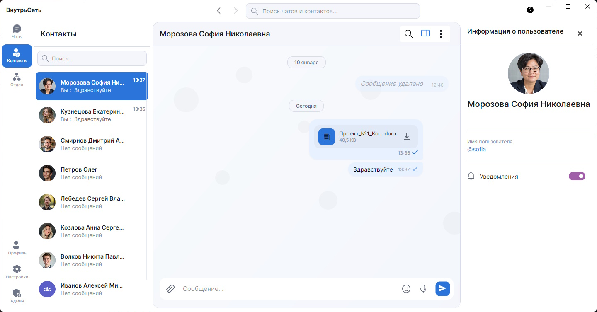

</div>

---

## О проекте

Корпоративный мессенджер — это современное решение для организации внутренней коммуникации в компаниях. Система обеспечивает безопасный обмен сообщениями, файлами и позволяет проводить опросы среди сотрудников.

Построен на клиент-серверной архитектуре с использованием **.NET 8**, **Avalonia UI** и **SignalR** для обмена сообщениями в реальном времени.

---

## Возможности

### Коммуникация
- Обмен сообщениями в реальном времени
- Групповые чаты и личные диалоги
- Отправка файлов (изображения, документы, видео)
- Создание опросов с анонимным голосованием
- Уведомления о новых сообщениях

### Организация
- Интеграция с отделами компании
- Глобальный поиск по чатам и сообщениям
- Профили пользователей с аватарами

### Настройки
- Темы оформления (светлая, тёмная, системная)
- Административная панель управления
- JWT-аутентификация

---

## Установка

### Системные требования

| Параметр | Минимальное значение | Рекомендуемое |
|----------|---------------------|---------------|
| **ОС** | Windows 10 / macOS 10.15 / Linux | Windows 11 / macOS 12+ |
| **ОЗУ** | 4 ГБ | 8 ГБ |
| **Диск** | 200 МБ | 500 МБ |
| **Runtime** | .NET 8.0 | .NET 8.0 |

### Установка клиента (из релиза)

1. Скачайте дистрибутив для вашей ОС
2. Распакуйте архив в удобную директорию
3. Установите [.NET 8.0 Runtime](https://dotnet.microsoft.com/download/dotnet/8.0) (если не установлен)
4. Запустите приложение:
   - **Windows:** `MessengerDesktop.exe`
   - **Linux/macOS:** `./MessengerDesktop`
5. Введите адрес сервера и авторизуйтесь

### Развёртывание сервера

#### 1. Подготовка базы данных

```sql
-- Подключитесь к PostgreSQL и создайте БД
CREATE DATABASE messenger_db;
CREATE USER messenger_user WITH ENCRYPTED PASSWORD 'your_password';
GRANT ALL PRIVILEGES ON DATABASE messenger_db TO messenger_user;
```

#### 2. Конфигурация сервера

Создайте файл `appsettings.Production.json`:

```json
{
  "ConnectionStrings": {
    "DefaultConnection": "Host=localhost;Database=messenger_db;Username=messenger_user;Password=your_password"
  },
  "JwtSettings": {
    "SecretKey": "your-secret-key-minimum-32-characters-long!",
    "Issuer": "MessengerAPI",
    "Audience": "MessengerClient",
    "ExpirationInDays": 7
  },
  "FileStorage": {
    "MaxFileSizeMB": 50,
    "AllowedExtensions": [".jpg", ".jpeg", ".png", ".gif", ".webp", ".pdf", ".doc", ".docx"]
  }
}
```

#### 3. Запуск

```bash
cd MessengerAPI
dotnet ef database update --configuration Production
dotnet run --configuration Release
```

---

## Структура проекта

```
📦 corporate-messenger
├── 📂 MessengerShared/          # Общие компоненты
│   ├── 📂 DTO/                  # Объекты передачи данных
│   ├── 📂 Enum/                 # Перечисления
│   └── 📂 Response/             # Обёртки ответов API
│
├── 📂 MessengerAPI/             # Серверная часть (ASP.NET Core)
│   ├── 📂 Controllers/          # REST API эндпоинты
│   ├── 📂 Services/             # Бизнес-логика
│   │   ├── AccessControlService # Проверка прав доступа
│   │   ├── OnlineUserService    # Статус пользователей
│   │   └── FileService          # Обработка файлов
│   ├── 📂 Hubs/                 # SignalR (ChatHub)
│   ├── 📂 Middleware/           # Обработка исключений
│   └── 📂 Helpers/              # JWT, расширения
│
├── 📂 MessengerDesktop/         # Клиент (Avalonia UI)
│   ├── 📂 ViewModels/           # MVVM логика
│   │   ├── 📂 Chat/             # Управление сообщениями
│   │   ├── 📂 Admin/            # Панель администратора
│   │   ├── 📂 Dialog/           # Модальные окна
│   │   └── 📂 Factories/        # Фабрики ViewModel
│   ├── 📂 Views/                # XAML разметка
│   ├── 📂 Services/             # Клиентские сервисы
│   │   ├── 📂 Api/              # HTTP-клиент
│   │   ├── 📂 Auth/             # Сессии, SecureStorage
│   │   └── 📂 Navigation/       # Навигация
│   ├── 📂 Controls/             # Кастомные контролы
│   └── 📂 Converters/           # XAML конвертеры
│
└── 📂 Messenger.Tests/          # Тесты
    ├── 📂 Controllers/          # Тесты API
    ├── 📂 Services/             # Тесты бизнес-логики
    └── 📂 Helpers/              # Моки и утилиты
```

---

## Скриншоты

<details>
<summary><b>Темы оформления</b></summary>

| Светлая тема | Тёмная тема |
|:------------:|:-----------:|
| 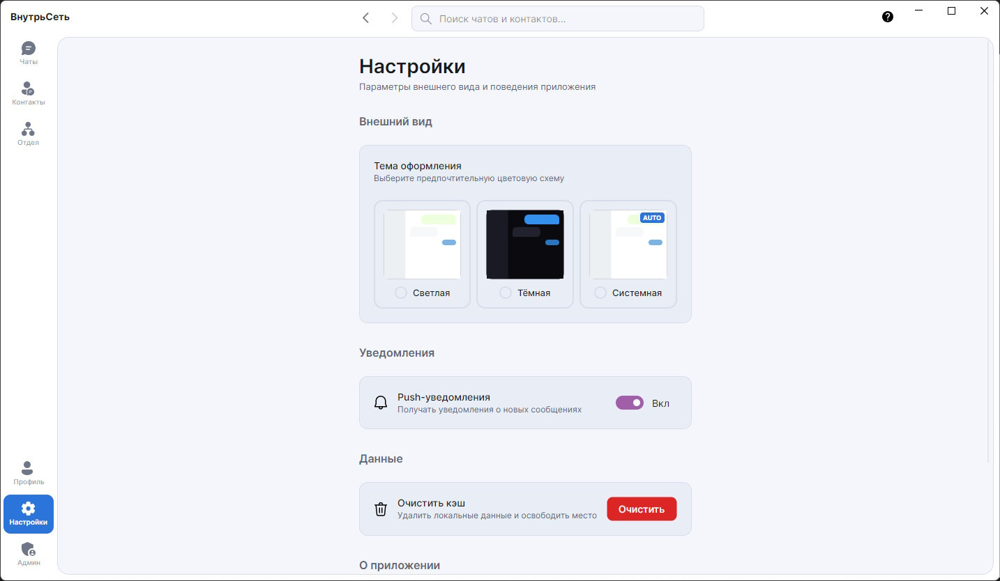 | 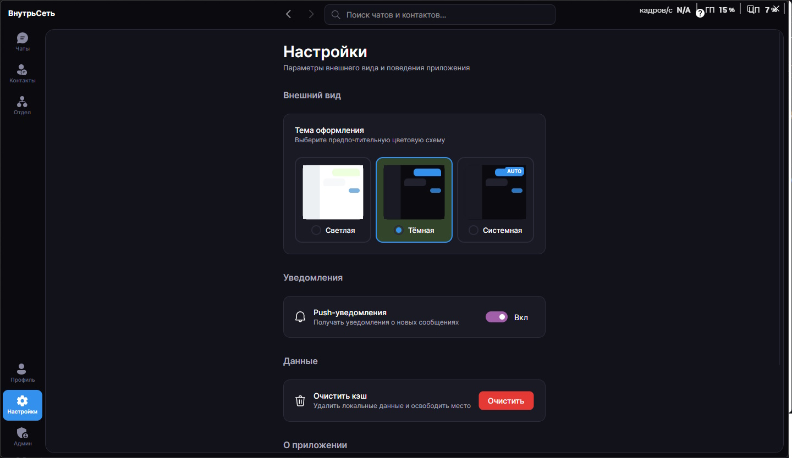 |

</details>

<details>
<summary><b>Авторизация и профиль</b></summary>

| Авторизация | Профиль | Настройки |
|:-----------:|:-------:|:---------:|
|  |  |  |

</details>

<details>
<summary><b>Чаты и сообщения</b></summary>

| Список диалогов | Переписка | Поиск в чате |
|:---------------:|:---------:|:------------:|
| 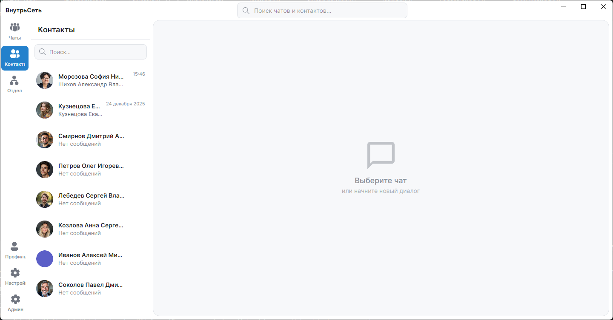 |  | 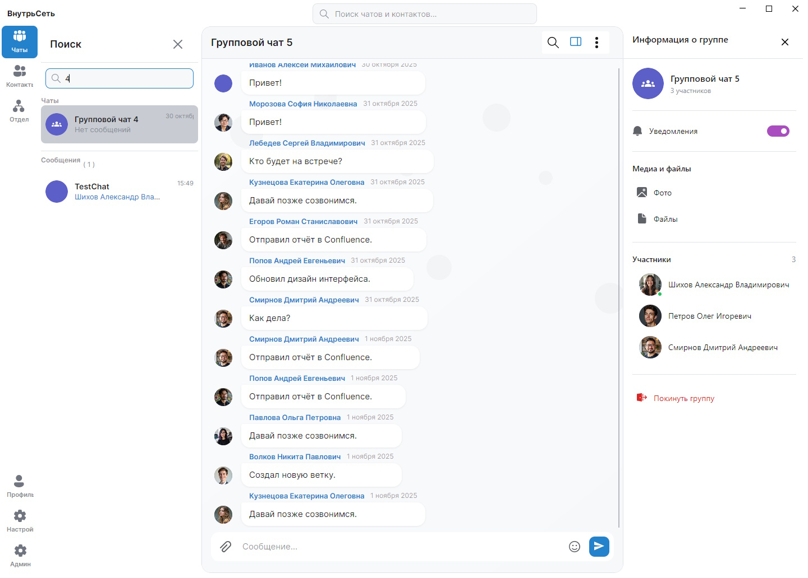 |

| Список чатов | Переписка | Создание чата |
|:------------:|:-------------:|:-------------:|
| 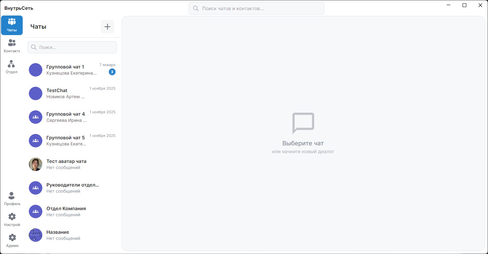 | 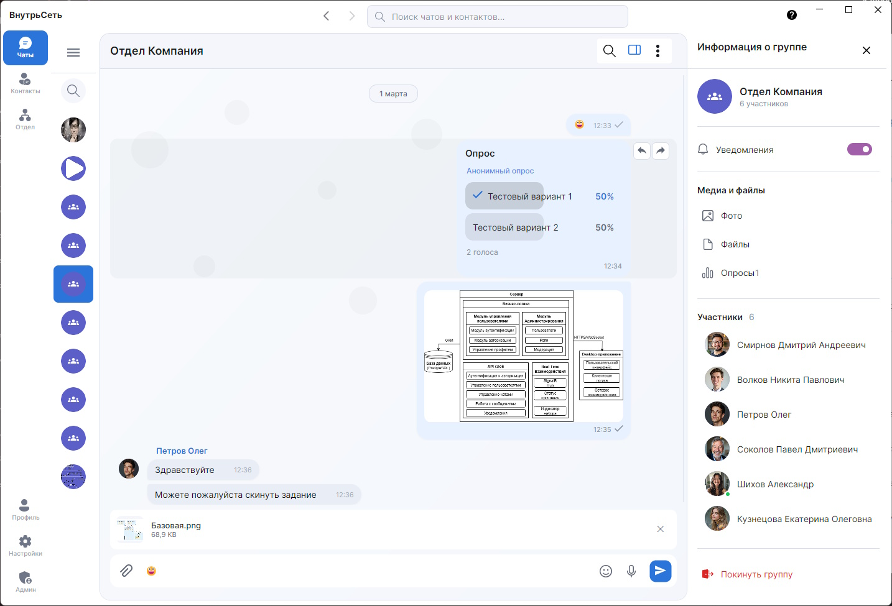 | 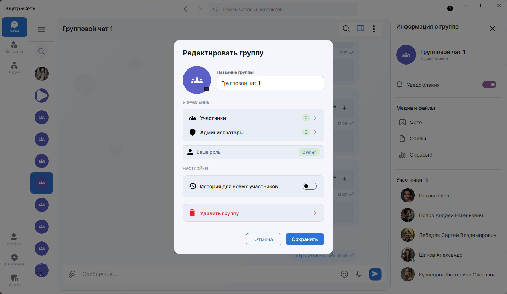 |

</details>

<details>
<summary><b>Опросы</b></summary>

| Создание опроса |
|:---------------:|
| 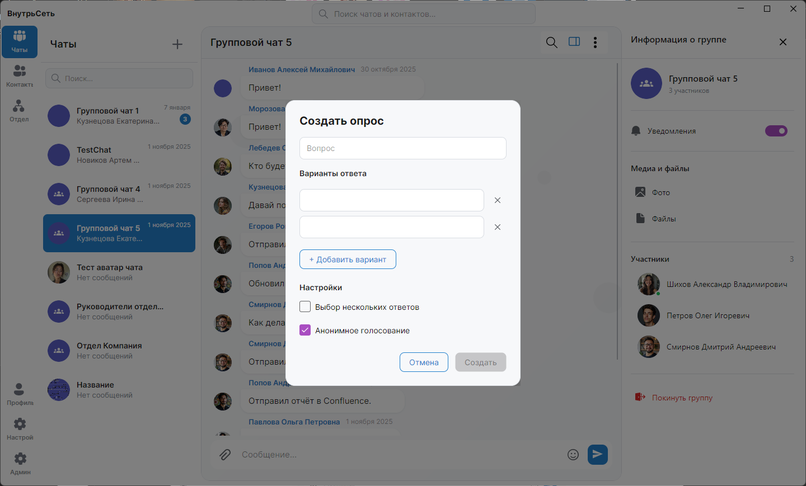 |

</details>

<details>
<summary><b>Администрирование</b></summary>

| Список сотрудников | Создание сотрудника |
|:------------------:|:-------------------:|
| 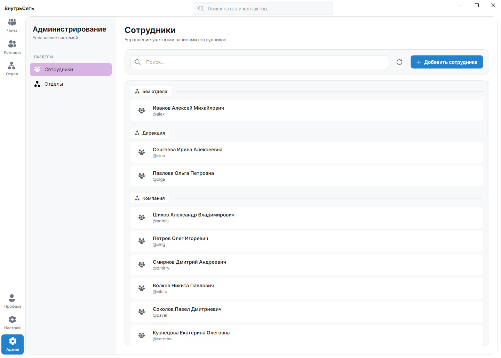 | 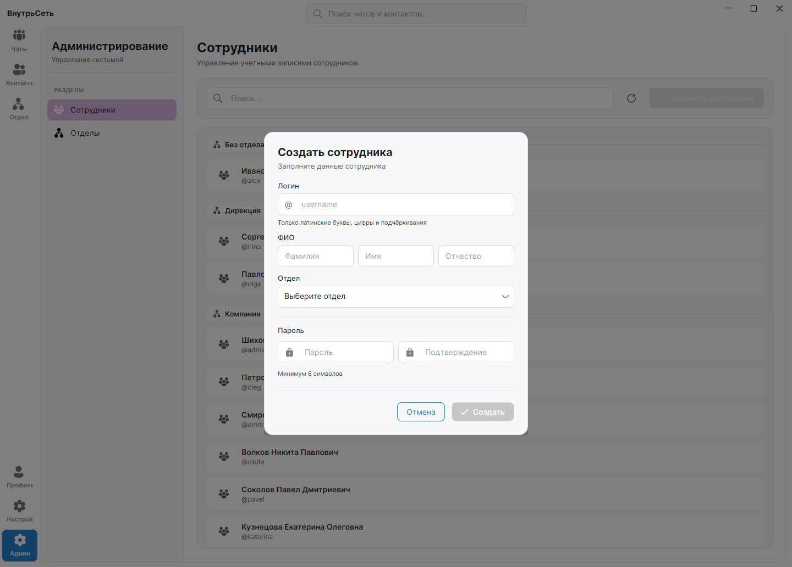 |

| Список отделов | Создание отдела |
|:--------------:|:---------------:|
| 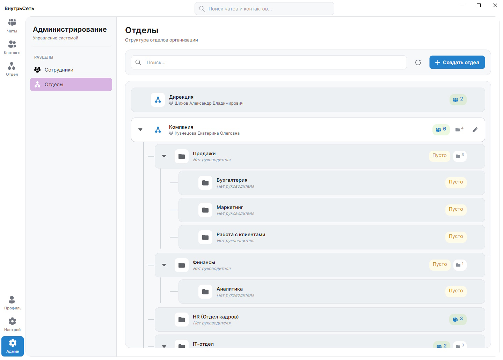 | 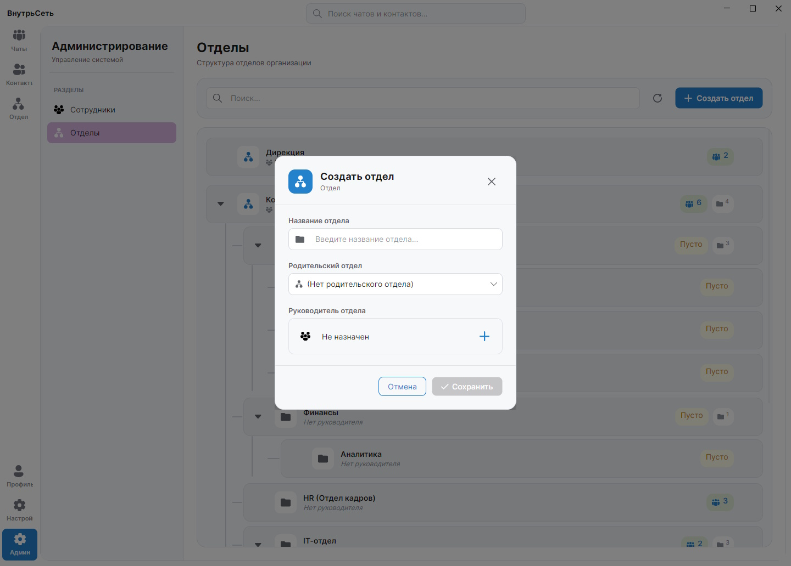 |

</details>
<details>
<summary><b>Руководитель отдела</b></summary>

| Страница руководителя | Добавление в отдел |
|:---------------------:|:------------------:|
|  | 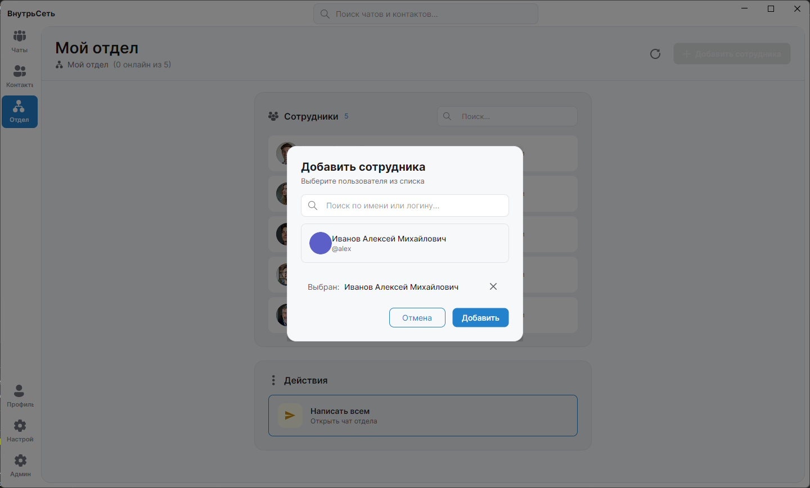 |

<details>

---

## Тестирование

```bash
# Запуск всех тестов
cd Messenger.Tests
dotnet test

# Запуск с покрытием
dotnet test --collect:"XPlat Code Coverage"

# Запуск конкретной категории
dotnet test --filter "Category=Controllers"
```

---

## API Документация

После запуска сервера документация доступна по адресу:

- **Swagger UI:** `https://localhost:5001/swagger`
- **OpenAPI JSON:** `https://localhost:5001/swagger/v1/swagger.json`

### Основные эндпоинты

| Метод | Endpoint | Описание |
|-------|----------|----------|
| `POST` | `/api/auth/login` | Авторизация |
| `POST` | `/api/auth/register` | Регистрация |
| `GET` | `/api/chats` | Список чатов |
| `POST` | `/api/chats` | Создание чата |
| `GET` | `/api/messages/{chatId}` | Сообщения чата |
| `POST` | `/api/messages` | Отправка сообщения |
| `POST` | `/api/files/upload` | Загрузка файла |

---

## Термины и сокращения

| Термин | Расшифровка | Описание |
|--------|-------------|----------|
| **API** | Application Programming Interface | Интерфейс программирования приложений |
| **JWT** | JSON Web Token | Токен для безопасной аутентификации |
| **DTO** | Data Transfer Object | Объект для передачи данных между слоями |
| **ORM** | Object-Relational Mapping | Технология связи объектов и БД |
| **SignalR** | — | Библиотека Microsoft для real-time коммуникации |
| **MVVM** | Model-View-ViewModel | Архитектурный паттерн для UI |
| **CRUD** | Create, Read, Update, Delete | Базовые операции с данными |
| **WebP** | — | Современный формат сжатия изображений |

---

## Контакты

| Канал | Контакт |
|-------|---------|
| Telegram | [@a35472](https://t.me/a35472) |