<div align="center">

# Корпоративный мессенджер

[](https://dotnet.microsoft.com/)
[](https://avaloniaui.net/)
[](https://www.postgresql.org/)
[](https://learn.microsoft.com/aspnet/core/signalr/)
[](https://docs.docker.com/compose/)
[](LICENSE)
[]()

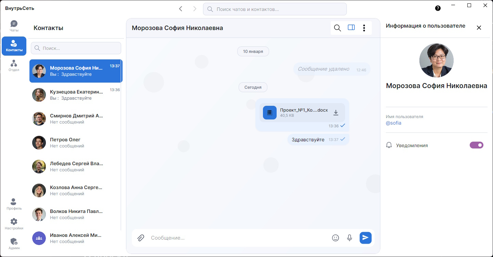

</div>

---

## О проекте

Корпоративный мессенджер — современное решение для организации внутренней коммуникации в компаниях. Система обеспечивает обмен сообщениями и файлами в реальном времени, голосовые сообщения с автоматической расшифровкой, опросы, управление отделами и ролевую модель доступа.

Построен на клиент-серверной архитектуре с использованием **.NET 8**, **Avalonia UI** (кроссплатформенный десктопный клиент) и **SignalR** для двусторонней связи в реальном времени. Клиент реализует стратегию **cache-first** с локальной базой SQLite и полнотекстовым поиском. Серверная часть контейнеризирована с помощью **Docker**.

---

## Возможности

### Коммуникация
- Обмен сообщениями в реальном времени (SignalR)
- Личные диалоги и групповые чаты
- Ответы на сообщения и пересылка с наследованием контента
- Редактирование и удаление (soft-delete) сообщений
- Голосовые сообщения с автоматической транскрибацией (Whisper)
- Отправка файлов до 20 МБ (изображения конвертируются в WebP)
- Создание опросов с анонимным и множественным голосованием
- Индикаторы набора текста и статусы прочтения
- Уведомления о новых сообщениях с настройкой мьютинга по чатам

### Организация
- Иерархическая структура отделов с защитой от циклов (BFS)
- Динамические роли: пользователь, руководитель отдела, администратор
- Управление составом отделов (руководитель / администратор)
- Глобальный поиск по чатам и сообщениям с подсветкой совпадений
- Поиск внутри отдельного чата
- Профили пользователей с аватарами
- Отслеживание онлайн-статуса в реальном времени

### Клиент
- Кроссплатформенный десктопный клиент (Windows, macOS, Linux)
- Темы оформления: светлая, тёмная, системная
- Офлайн-доступ к истории сообщений (SQLite кеш, FTS5 полнотекстовый поиск)
- Мгновенное отображение кеша с фоновой синхронизацией (stale-while-revalidate)
- Безопасное хранение учётных данных (DPAPI / Keychain / libsecret)
- Скачивание файлов с прогрессом и открытие в системном приложении
- Адаптивный интерфейс с группировкой сообщений

### Администрирование
- Панель управления пользователями (создание, блокировка)
- Управление структурой отделов
- JWT-аутентификация с ротацией refresh-токенов и защитой от replay-атак
- Rate limiting (sliding window) для защиты от перегрузки
- Контейнеризация серверной части (Docker Compose)
- Сканирование безопасности (OWASP ZAP)

---

## Технологический стек

| Компонент | Технологии |
|-----------|-----------|
| **Сервер** | ASP.NET Core 8, Entity Framework Core, SignalR, PostgreSQL 16 |
| **Клиент** | Avalonia UI 11.3, CommunityToolkit.Mvvm, sqlite-net-pcl, SignalR Client, NAudio |
| **Медиа** | SixLabors.ImageSharp (ресайз/WebP), NAudio (запись/воспроизведение аудио), whisper.cpp (транскрибация) |
| **Безопасность** | JWT Bearer (ротация + FamilyId), BCrypt, Rate Limiting, DPAPI/Keychain/libsecret |
| **Инфраструктура** | Docker, Docker Compose, multi-stage build |
| **Общие** | .NET 8 Class Library (DTO, Enums, ApiResponse\<T\>) |

---

## Установка

### Системные требования

| Параметр | Минимальное значение | Рекомендуемое |
|----------|---------------------|---------------|
| **ОС** | Windows 10 / macOS 10.15 / Linux | Windows 11 / macOS 12+ |
| **ОЗУ** | 4 ГБ | 8 ГБ |
| **Диск** | 200 МБ | 500 МБ |
| **Runtime** | .NET 8.0 | .NET 8.0 |

### Установка клиента (из релиза)

1. Скачайте дистрибутив для вашей ОС
2. Распакуйте архив в удобную директорию
3. Установите [.NET 8.0 Runtime](https://dotnet.microsoft.com/download/dotnet/8.0) (если не установлен)
4. Запустите приложение:
   - **Windows:** `MessengerDesktop.exe`
   - **Linux/macOS:** `./MessengerDesktop`
5. Авторизуйтесь с учётной записью, созданной администратором

> **Примечание:** Регистрация пользователей осуществляется только администратором через панель управления.

---

### Развёртывание сервера

#### Вариант 1: Docker Compose (рекомендуется)

Самый быстрый способ — одна команда поднимает API-сервер и PostgreSQL:

```bash
# Запуск сервера и базы данных
docker compose -f docker-compose.server.yml up -d

# Проверка статуса
docker compose -f docker-compose.server.yml ps

# Просмотр логов
docker compose -f docker-compose.server.yml logs -f messenger-api

# Остановка
docker compose -f docker-compose.server.yml down
```

Сервер будет доступен на `http://localhost:8080`. База данных создаётся автоматически.

**Что включено:**
- **messenger-api** — API-сервер (порт 8080), multi-stage build, non-root user
- **postgres** — PostgreSQL 16 Alpine с healthcheck
- **Volumes** — персистентное хранение: БД (`postgres_data`), загруженные файлы (`messenger_uploads`), аватары (`messenger_avatars`)

##### Сканирование безопасности (OWASP ZAP)

```bash
# Запуск baseline-сканирования
docker compose -f docker-compose.server.yml --profile security up zap-baseline

# Отчёты сохраняются в ./security-reports/
```

##### Настройка переменных окружения

По умолчанию Docker Compose использует тестовые значения. Для продакшена переопределите через `.env` файл или переменные окружения:

```bash
# .env
POSTGRES_PASSWORD=strong_production_password
ASPNETCORE_ENVIRONMENT=Production
```

Или напрямую:

```bash
docker compose -f docker-compose.server.yml up -d \
  -e POSTGRES_PASSWORD=strong_production_password
```

#### Вариант 2: Ручное развёртывание

##### 1. Подготовка базы данных

```sql
CREATE DATABASE messenger_db;
CREATE USER messenger_user WITH ENCRYPTED PASSWORD 'your_password';
GRANT ALL PRIVILEGES ON DATABASE messenger_db TO messenger_user;
```

##### 2. Конфигурация сервера

Создайте файл `appsettings.Production.json`:

```json
{
  "ConnectionStrings": {
    "DefaultConnection": "Host=localhost;Database=messenger_db;Username=messenger_user;Password=your_password"
  },
  "Jwt": {
    "Secret": "your-secret-key-minimum-32-characters-long!",
    "LifetimeHours": 24,
    "Issuer": "MessengerAPI",
    "Audience": "MessengerClient"
  },
  "Messenger": {
    "AdminDepartmentId": 1,
    "MaxFileSizeBytes": 20971520,
    "BcryptWorkFactor": 12,
    "MaxImageDimension": 1600,
    "ImageQuality": 85,
    "DefaultPageSize": 50,
    "MaxPageSize": 100
  }
}
```

##### 3. Транскрибация голосовых сообщений (опционально)

Для работы транскрибации необходим [whisper.cpp](https://github.com/ggerganov/whisper.cpp) и модель `ggml-small-q5_1.bin`.

##### 4. Запуск

```bash
cd MessengerAPI
dotnet ef database update
dotnet run --configuration Release
```

Сервер автоматически создаст директории `wwwroot/uploads` и `wwwroot/avatars`.

---

## Структура проекта

```
📦 Messenger
├── 📂 MessengerShared/              # Общие компоненты (Class Library)
│   ├── 📂 DTOs/                     # Объекты передачи данных
│   │   ├── 📂 Auth/                 # LoginRequest, AuthResponseDto
│   │   ├── 📂 Chat/                 # ChatDto, ChatMemberDto, UpdateChatDto
│   │   ├── 📂 Department/           # DepartmentDto, UpdateDepartmentMemberDto
│   │   ├── 📂 Message/              # MessageDto, MessageFileDto, PagedMessagesDto
│   │   ├── 📂 Notification/         # NotificationDto
│   │   ├── 📂 Online/               # OnlineStatusDto
│   │   ├── 📂 Poll/                 # PollDto, CreatePollDto, PollVoteDto
│   │   ├── 📂 ReadReceipt/          # MarkAsReadDto, UnreadCountDto
│   │   ├── 📂 Search/               # GlobalSearchResponseDto, SearchMessagesResponseDto
│   │   └── 📂 User/                 # UserDto, CreateUserDto, ChangePasswordDto
│   ├── 📂 Enums/                    # ChatRole, ChatType, Theme, UserRole, SystemEventType
│   └── 📄 ApiResponse.cs            # ApiResponse<T>, ApiResponseHelper
│
├── 📂 MessengerAPI/                 # Серверная часть (ASP.NET Core)
│   ├── 📂 Common/                   # BaseService<T>, Result<T>, ValidationHelper
│   ├── 📂 Configuration/            # DI, JWT, Swagger, StaticFiles, MessengerSettings
│   ├── 📂 Controllers/              # REST API эндпоинты
│   │   ├── BaseController           # ExecuteAsync, GetCurrentUserId
│   │   ├── AuthController           # Авторизация, refresh, revoke
│   │   ├── AdminController          # Управление пользователями (Admin)
│   │   ├── ChatsController          # CRUD чатов, участники, аватары
│   │   ├── MessagesController       # CRUD сообщений, поиск, пагинация
│   │   ├── FilesController          # Загрузка файлов
│   │   ├── PollController           # Опросы и голосование
│   │   ├── ReadReceiptsController   # Статусы прочтения
│   │   ├── NotificationController   # Настройки уведомлений
│   │   ├── UserController           # Профили, онлайн-статусы
│   │   └── DepartmentController     # Управление отделами
│   ├── 📂 Hubs/                     # SignalR (ChatHub)
│   ├── 📂 Mapping/                  # Маппинг Entity ↔ DTO (статические методы)
│   ├── 📂 Middleware/               # ExceptionHandling, MissingFileCleanup
│   ├── 📂 Models/                   # EF Core сущности + DbContext
│   ├── 📄 Dockerfile                # Multi-stage build, non-root user
│   └── 📂 Services/                 # Бизнес-логика
│       ├── 📂 Auth/                 # AuthService, TokenService
│       ├── 📂 Base/                 # BaseService (SaveChanges, Paginate)
│       ├── 📂 Chat/                 # ChatService, ChatMemberService, NotificationService
│       ├── 📂 Department/           # DepartmentService (BFS, иерархия)
│       ├── 📂 Infrastructure/       # AccessControl, CacheService, HubNotifier, OnlineUserService
│       ├── 📂 Messaging/            # MessageService, FileService, PollService, TranscriptionService
│       ├── 📂 ReadReceipt/          # ReadReceiptService
│       └── 📂 User/                 # UserService, AdminService
│
├── 📂 MessengerDesktop/             # Клиент (Avalonia UI, MVVM)
│   ├── 📂 Controls/                 # Кастомные контролы
│   │   ├── AvatarControl            # Аватар с инициалами и онлайн-индикатором
│   │   ├── RichMessageTextBlock     # Кликабельные ссылки в сообщениях
│   │   ├── MessageControl           # Контрол сообщения (8 StyledProperty-команд)
│   │   ├── SearchBox                # Поле поиска с очисткой
│   │   ├── CircularProgress         # Круговой прогресс-бар
│   │   ├── ThemeSelectorControl     # Переключатель тем с превью
│   │   └── *Skeleton                # Skeleton-заглушки (чаты, сообщения, инфо-панель)
│   ├── 📂 Converters/               # XAML конвертеры (ConverterBase, ConverterLocator)
│   ├── 📂 Data/                     # Локальный кеш (SQLite)
│   │   ├── LocalDatabase            # WAL, FTS5, schema versioning (user_version)
│   │   ├── 📂 Entities/             # CachedChat, CachedMessage, CachedUser, CachedReadPointer, ChatSyncState
│   │   ├── 📂 Mappers/              # CacheMapper (DTO ↔ Entity, Poll/Files → JSON)
│   │   └── 📂 Repositories/         # ChatCacheRepository, MessageCacheRepository, LocalCacheService
│   ├── 📂 Infrastructure/           # DI, ApiEndpoints, AppConstants, Helpers
│   │   ├── ApiEndpoints             # Параметризованные URL-шаблоны
│   │   ├── AppConstants             # Debounce, пагинация, таймауты
│   │   ├── AuthenticatedImageLoader # Bearer token для загрузки изображений
│   │   ├── AvatarHelper             # Safe URI, cache buster
│   │   └── MimeTypeHelper           # Расширение → MIME type
│   ├── 📂 Services/                 # Клиентские сервисы
│   │   ├── 📂 Api/                  # ApiClientService (auto-refresh при 401)
│   │   ├── 📂 Audio/                # AudioPlayerService, NAudioRecorderService, TranscriptionPoller
│   │   ├── 📂 Auth/                 # AuthManager, SecureStorageService, SessionStore
│   │   ├── 📂 Cache/                # CacheMaintenanceService
│   │   ├── 📂 Navigation/           # NavigationService, DialogService (stack-based)
│   │   ├── 📂 Platform/             # PlatformService, FileDownloadService
│   │   ├── 📂 Realtime/             # GlobalHubConnection (auto-reconnect)
│   │   ├── 📂 Storage/              # SettingsService
│   │   └── 📂 UI/                   # NotificationService, ThemeService
│   ├── 📂 ViewModels/               # MVVM логика
│   │   ├── 📂 Shell/                # MainWindowVM, MainMenuVM
│   │   ├── 📂 Auth/                 # LoginViewModel (auto-login)
│   │   ├── 📂 Chats/                # ChatsVM, ChatListItemVM, GlobalSearchManager
│   │   ├── 📂 Chat/                 # Handler-based архитектура
│   │   │   ├── ChatViewModel        # Тонкий координатор (~300 строк)
│   │   │   ├── ChatContext           # Shared state (ObservableObject)
│   │   │   ├── ChatFeatureHandler    # Абстрактный базовый класс
│   │   │   ├── 📂 Handlers/         # EditDelete, Reply, Forward, Typing, Voice,
│   │   │   │                        # InfoPanel, Search, Notification, HubSubscriber
│   │   │   ├── 📂 Managers/         # ChatMessageManager, ChatAttachmentManager, ChatMemberLoader
│   │   │   ├── MessageViewModel     # 30+ observable, аудио, опросы
│   │   │   ├── MessageFileViewModel # Скачивание с прогрессом
│   │   │   ├── PollViewModel        # Голосование, ApplyDto
│   │   │   └── VoiceRecordingVM     # Запись, таймер, статусы
│   │   ├── 📂 Admin/                # AdminVM, UsersTabVM, DepartmentsTabVM
│   │   ├── 📂 Department/           # DepartmentManagementVM
│   │   ├── 📂 Dialog/               # ChatEdit, Confirm, Poll, UserEdit, UserPicker,
│   │   │                            # UserProfile, Department, DepartmentHead
│   │   └── 📂 Factories/            # ChatViewModelFactory, ChatsViewModelFactory
│   └── 📂 Views/                    # XAML разметка (зеркалирует ViewModels)
│
├── 📂 Messenger.Tests/              # Тесты
│   ├── 📂 Controllers/              # Тесты API
│   ├── 📂 Services/                 # Тесты бизнес-логики
│   └── 📂 Helpers/                  # Моки и утилиты
│
├── 📄 docker-compose.server.yml     # Оркестрация: API + PostgreSQL + ZAP
└── 📄 README.md
```

---

## Скриншоты

<details>
<summary><b>Темы оформления</b></summary>

| Светлая тема | Тёмная тема |
|:------------:|:-----------:|
| 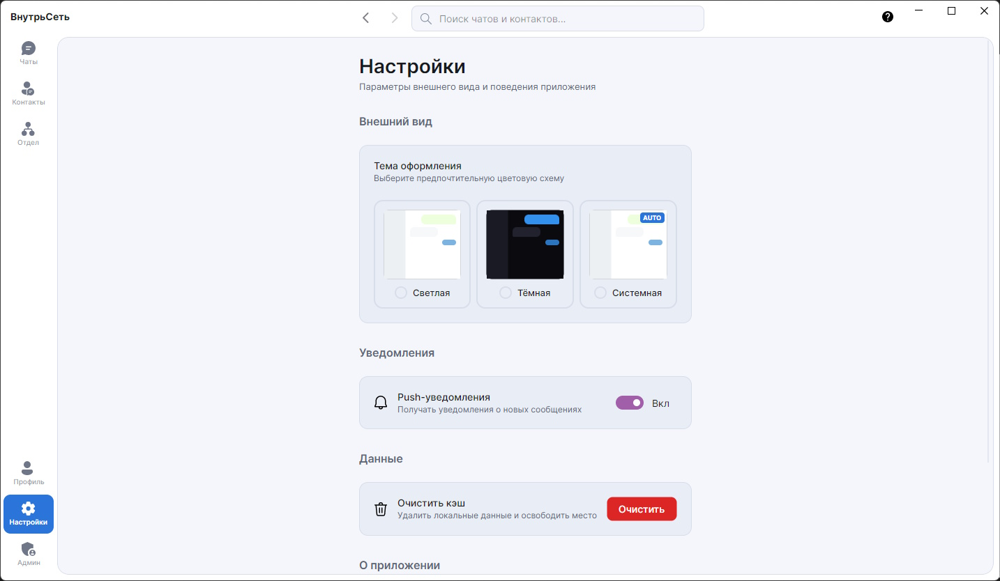 | 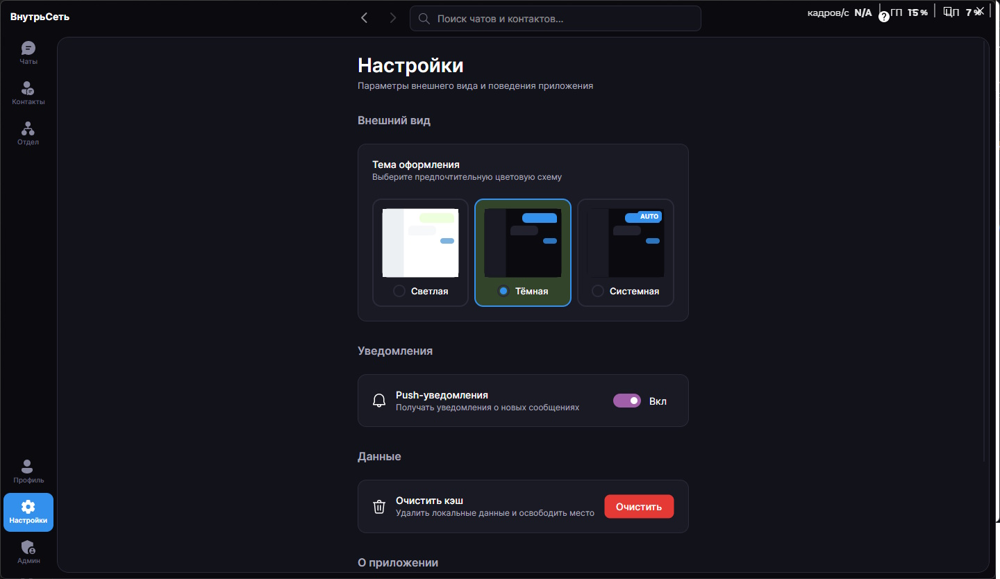 |

</details>

<details>
<summary><b>Авторизация и профиль</b></summary>

| Авторизация | Профиль | Настройки |
|:-----------:|:-------:|:---------:|
| 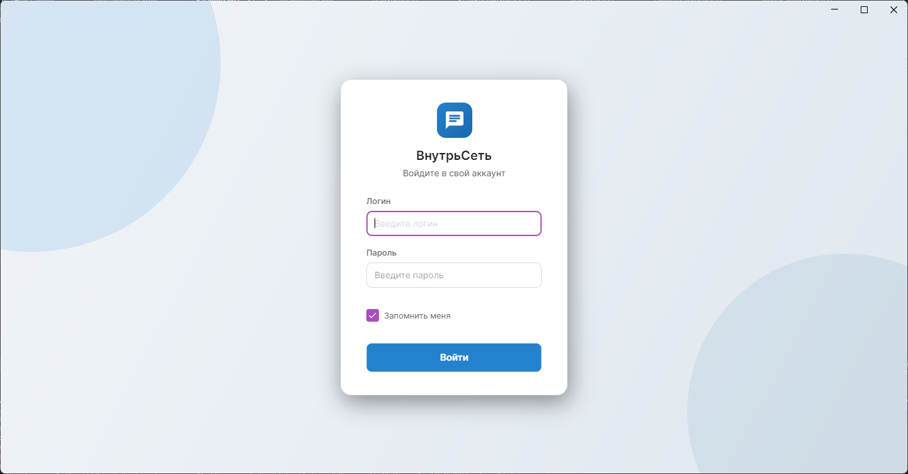 | 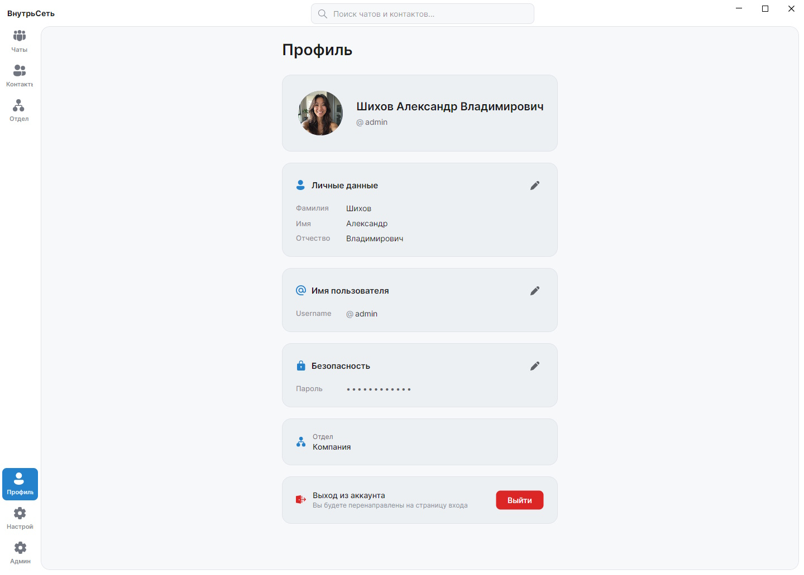 |  |

</details>

<details>
<summary><b>Чаты и сообщения</b></summary>

| Список диалогов | Переписка | Поиск в чате |
|:---------------:|:---------:|:------------:|
| 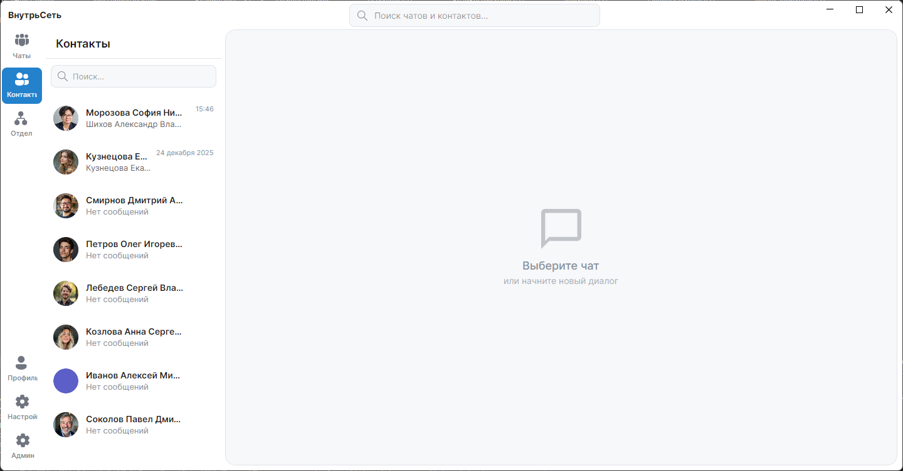 |  | 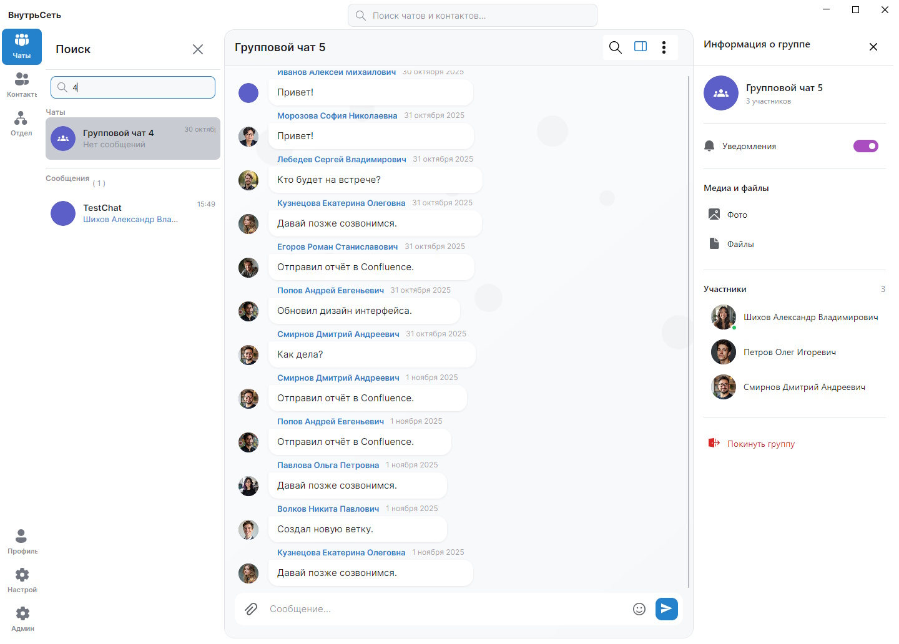 |

| Список чатов | Переписка | Создание чата |
|:------------:|:-------------:|:-------------:|
| 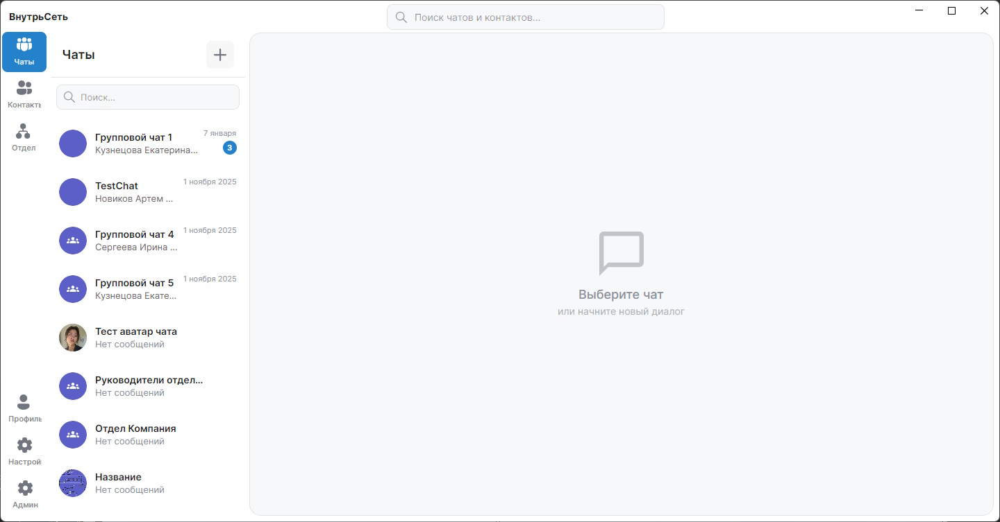 | 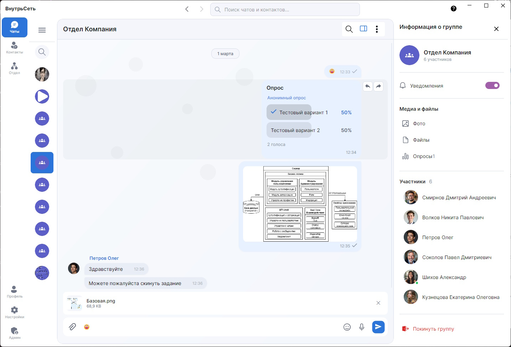 | 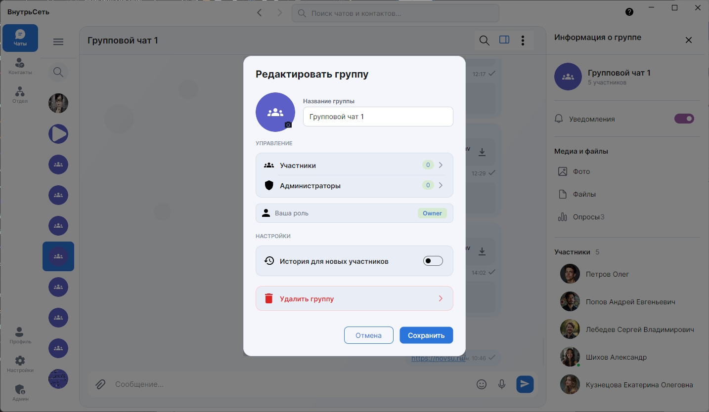 |

</details>

<details>
<summary><b>Опросы</b></summary>

| Создание опроса |
|:---------------:|
| 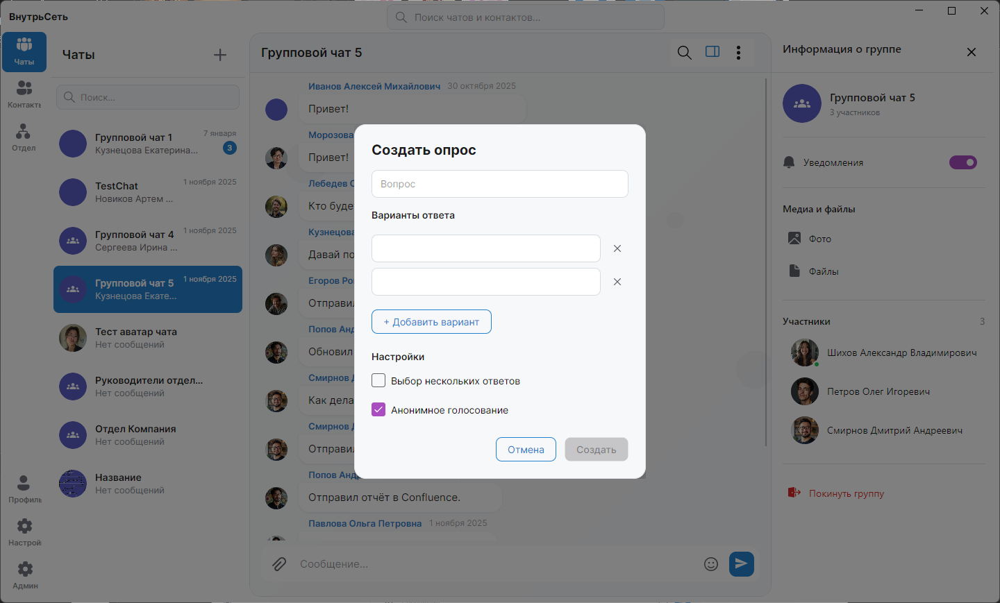 |

</details>

<details>
<summary><b>Администрирование</b></summary>

| Список сотрудников | Создание сотрудника |
|:------------------:|:-------------------:|
| 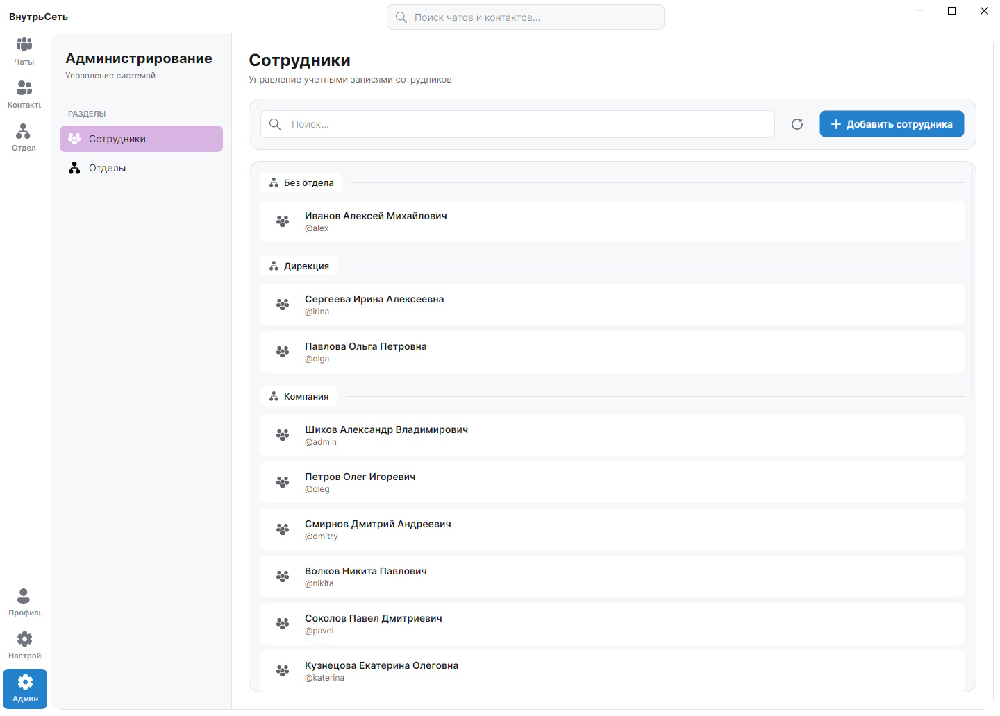 | 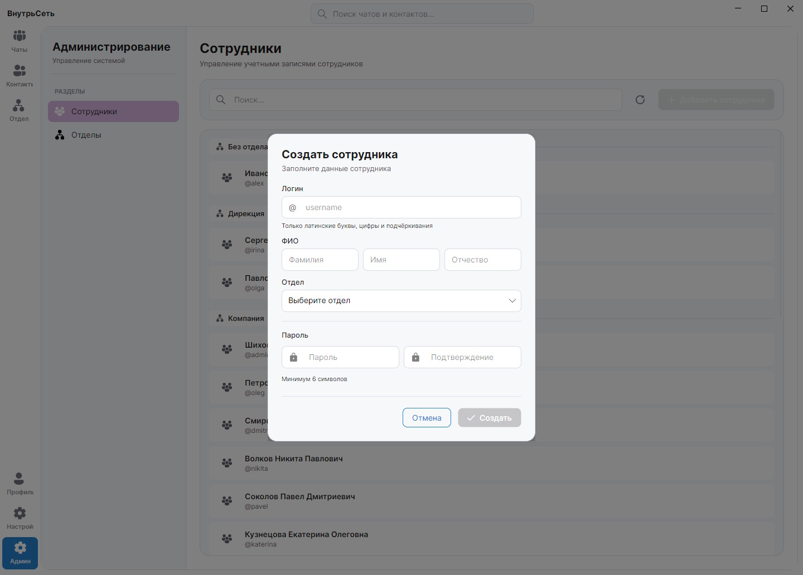 |

| Список отделов | Создание отдела |
|:--------------:|:---------------:|
| 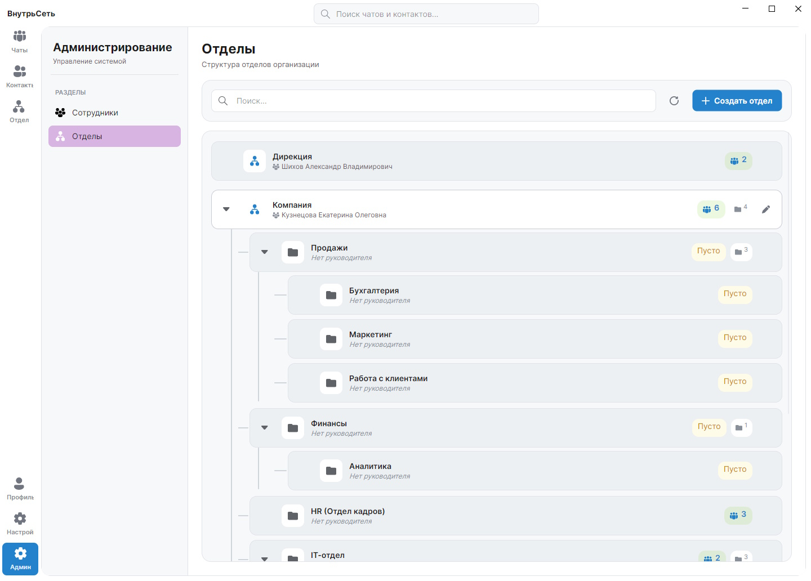 | 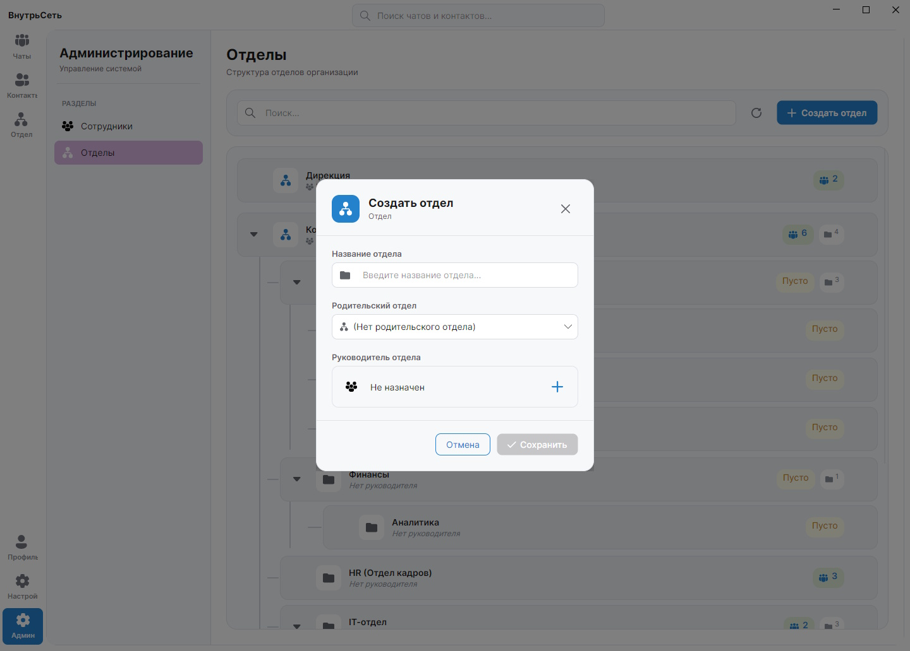 |

</details>

<details>
<summary><b>Руководитель отдела</b></summary>

| Страница руководителя | Добавление в отдел |
|:---------------------:|:------------------:|
| 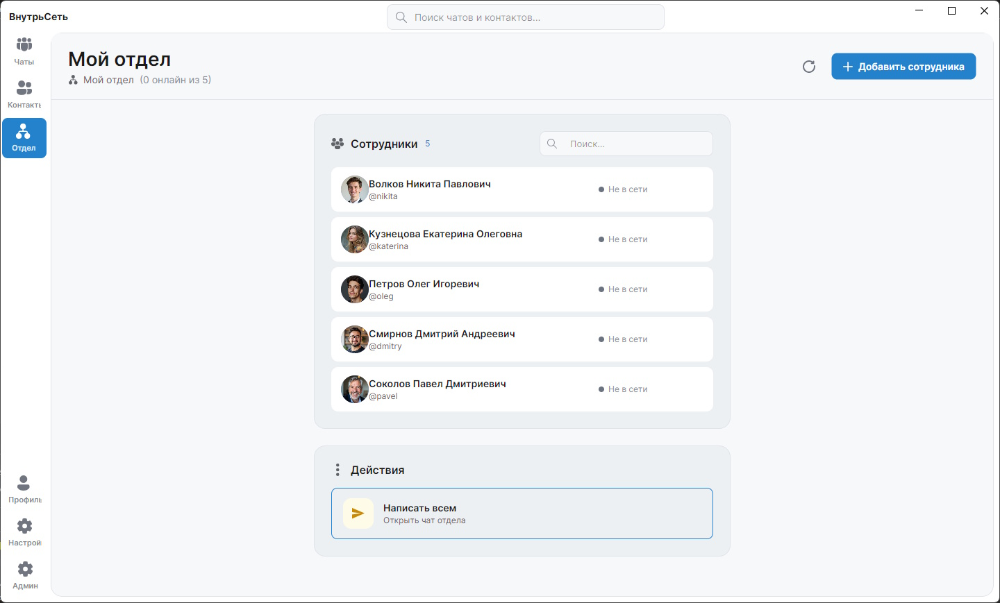 | 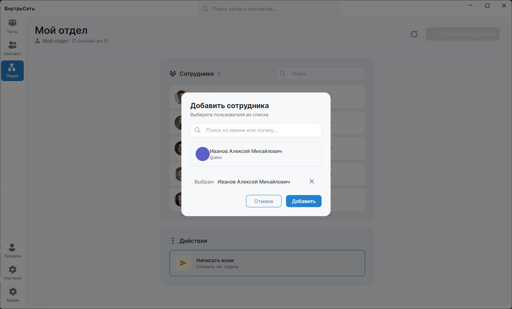 |

</details>

---

## API Документация

После запуска сервера в режиме разработки документация доступна:

- **Swagger UI:** `https://localhost:7190/swagger`
- **OpenAPI JSON:** `https://localhost:7190/swagger/v1/swagger.json`

> При запуске через Docker (порт 8080): `http://localhost:8080/swagger`

> Все эндпоинты (кроме `/api/auth/login`) требуют JWT-аутентификации (заголовок `Authorization: Bearer <token>`).

### Основные эндпоинты

#### Аутентификация

| Метод | Endpoint | Описание |
|-------|----------|----------|
| `POST` | `/api/auth/login` | Авторизация (AllowAnonymous) |
| `POST` | `/api/auth/refresh` | Обновление токенов (ротация) |
| `POST` | `/api/auth/revoke` | Отзыв refresh-токенов |

#### Пользователи

| Метод | Endpoint | Описание |
|-------|----------|----------|
| `GET` | `/api/user` | Список всех пользователей |
| `GET` | `/api/user/{id}` | Профиль пользователя |
| `PUT` | `/api/user/{id}` | Обновление профиля |
| `POST` | `/api/user/{id}/avatar` | Загрузка аватара |
| `PUT` | `/api/user/{id}/username` | Смена имени пользователя |
| `PUT` | `/api/user/{id}/password` | Смена пароля |
| `GET` | `/api/user/online` | Список онлайн-пользователей |
| `POST` | `/api/user/status/batch` | Статусы группы пользователей |

#### Чаты

| Метод | Endpoint | Описание |
|-------|----------|----------|
| `GET` | `/api/chats/user/{userId}/chats` | Все чаты пользователя |
| `GET` | `/api/chats/user/{userId}/dialogs` | Личные диалоги |
| `GET` | `/api/chats/user/{userId}/groups` | Групповые чаты |
| `GET` | `/api/chats/user/{userId}/contact/{contactUserId}` | Диалог с конкретным пользователем |
| `GET` | `/api/chats/{chatId}` | Информация о чате |
| `POST` | `/api/chats` | Создание чата |
| `PUT` | `/api/chats/{id}` | Обновление чата |
| `DELETE` | `/api/chats/{id}` | Удаление чата (Owner) |
| `POST` | `/api/chats/{id}/avatar` | Аватар чата |
| `GET` | `/api/chats/{chatId}/members` | Участники чата |
| `POST` | `/api/chats/{chatId}/members` | Добавление участника |
| `DELETE` | `/api/chats/{chatId}/members/{userId}` | Удаление участника |
| `PUT` | `/api/chats/{chatId}/members/{userId}/role` | Изменение роли (Owner) |

#### Сообщения

| Метод | Endpoint | Описание |
|-------|----------|----------|
| `POST` | `/api/messages` | Отправка сообщения |
| `PUT` | `/api/messages/{id}` | Редактирование |
| `DELETE` | `/api/messages/{id}` | Удаление (soft-delete) |
| `GET` | `/api/messages/chat/{chatId}` | История (пагинация) |
| `GET` | `/api/messages/chat/{chatId}/around/{messageId}` | Сообщения вокруг |
| `GET` | `/api/messages/chat/{chatId}/before/{messageId}` | Сообщения до |
| `GET` | `/api/messages/chat/{chatId}/after/{messageId}` | Сообщения после |
| `GET` | `/api/messages/chat/{chatId}/search` | Поиск в чате |
| `GET` | `/api/messages/user/{userId}/search` | Глобальный поиск |
| `GET` | `/api/messages/{id}/transcription` | Статус транскрибации |
| `POST` | `/api/messages/{id}/transcription/retry` | Повтор транскрибации |

#### Файлы, опросы, прочтения, уведомления

| Метод | Endpoint | Описание |
|-------|----------|----------|
| `POST` | `/api/files/upload?chatId={id}` | Загрузка файла |
| `POST` | `/api/poll` | Создание опроса |
| `POST` | `/api/poll/vote` | Голосование |
| `GET` | `/api/poll/{id}` | Информация об опросе |
| `POST` | `/api/readreceipts/mark-read` | Отметить прочитанным |
| `GET` | `/api/readreceipts/unread-counts` | Счётчики непрочитанных |
| `GET` | `/api/notifications/{chatId}` | Настройки уведомлений чата |
| `PUT` | `/api/notifications/{chatId}` | Изменение настроек уведомлений |

#### Администрирование

| Метод | Endpoint | Описание |
|-------|----------|----------|
| `GET` | `/api/admin/users` | Список пользователей (Admin) |
| `POST` | `/api/admin/users` | Создание пользователя (Admin) |
| `POST` | `/api/admin/users/{id}/toggle-ban` | Блокировка/разблокировка (Admin) |

#### Отделы

| Метод | Endpoint | Описание |
|-------|----------|----------|
| `GET` | `/api/department` | Все отделы |
| `POST` | `/api/department` | Создание (Admin) |
| `PUT` | `/api/department` | Обновление (Admin) |
| `DELETE` | `/api/department` | Удаление (Admin) |
| `GET` | `/api/department/{id}/members` | Сотрудники отдела |
| `POST` | `/api/department/{id}/members` | Добавление сотрудника |
| `DELETE` | `/api/department/{id}/members` | Удаление сотрудника |

#### SignalR Hub

| Endpoint | Описание |
|----------|----------|
| `/chatHub` | Real-time: сообщения, typing, online/offline, read receipts, опросы, транскрибация |

---

## Архитектурные особенности

### Серверная часть
- **Result-паттерн** — сервисы возвращают `Result<T>`, контроллеры маппят в HTTP-коды через `ExecuteAsync`
- **Двухуровневый кеш доступа** — per-request Dictionary (L1) + IMemoryCache (L2) для проверки членства в чатах
- **Транскрибация** — Channel\<int\> очередь + BackgroundService + whisper.cpp CLI с SemaphoreSlim(1), timeout 5 минут
- **Timing-safe аутентификация** — dummy BCrypt.Verify при несуществующем пользователе
- **Refresh-токены** — ротация с FamilyId, replay detection (повторное использование → отзыв всей семьи), лимит 5 сессий
- **Rate limiting** — Sliding Window: глобально 100/10с, login 5/1мин, upload 10/1мин, search 15/1мин, messaging 30/1мин
- **Системные сообщения** — автоматические при создании чата, добавлении/удалении участников, смене ролей
- **Контейнеризация** — multi-stage Docker build, non-root user, healthcheck PostgreSQL

### Клиентская часть
- **Handler-based декомпозиция** — ChatViewModel как тонкий координатор (~300 строк), бизнес-логика в `ChatFeatureHandler`-подклассах (EditDelete, Reply, Forward, Typing, Voice, InfoPanel, Search, Notification), shared state в `ChatContext`
- **Stale-while-revalidate** — мгновенный показ кеша, фоновая загрузка актуальных данных
- **Cache-first сообщения** — SQLite → рендер → revalidate с заполнением пробелов после реконнекта (gap-fill, max 5 батчей → reset)
- **Mutual exclusive modes** — edit/reply/forward: активация одного режима сбрасывает остальные через событие CompositionModeReset
- **Группировка сообщений** — порог 2 минуты → позиции Alone/First/Middle/Last для визуальной стилизации
- **Воспроизведение аудио** — Singleton AudioPlayerService с фильтрацией по messageId, кеширование потока
- **Скачивание файлов** — прогресс, уникальные имена, открытие в системном приложении / папке (кроссплатформенно)

### Инфраструктура
- **Docker Compose** — оркестрация API + PostgreSQL + опциональный ZAP-сканер
- **Персистентные volumes** — данные БД, загруженные файлы и аватары сохраняются между перезапусками
- **OWASP ZAP** — автоматизированное baseline-сканирование безопасности (профиль `security`)
- **Security headers** — COEP, COOP, CORP, X-Content-Type-Options

---

## Тестирование

```bash
# Запуск всех тестов
cd Messenger.Tests
dotnet test

# Запуск с покрытием
dotnet test --collect:"XPlat Code Coverage"

# Запуск конкретной категории
dotnet test --filter "Category=Controllers"
```

### Сканирование безопасности

```bash
# Запуск OWASP ZAP baseline scan (требуется запущенный сервер)
docker compose -f docker-compose.server.yml --profile security up zap-baseline

# Отчёты: ./security-reports/zap-report.html, zap-report.json, zap-warnings.md
```

---

## Термины и сокращения

| Термин | Расшифровка | Описание |
|--------|-------------|----------|
| **API** | Application Programming Interface | Интерфейс программирования приложений |
| **JWT** | JSON Web Token | Токен для безопасной аутентификации |
| **DTO** | Data Transfer Object | Объект для передачи данных между слоями |
| **ORM** | Object-Relational Mapping | Технология связи объектов и БД |
| **SignalR** | — | Библиотека Microsoft для real-time коммуникации |
| **MVVM** | Model-View-ViewModel | Архитектурный паттерн для UI |
| **CRUD** | Create, Read, Update, Delete | Базовые операции с данными |
| **WebP** | — | Современный формат сжатия изображений |
| **FTS5** | Full-Text Search 5 | Модуль полнотекстового поиска SQLite |
| **WAL** | Write-Ahead Logging | Режим журналирования SQLite для конкурентности |
| **BFS** | Breadth-First Search | Поиск в ширину (проверка циклов в иерархии) |
| **ZAP** | Zed Attack Proxy | Инструмент OWASP для сканирования безопасности |
| **DPAPI** | Data Protection API | Windows API для шифрования данных пользователя |

---

## Контакты

| Канал | Контакт |
|-------|---------|
| Telegram | [@a35472](https://t.me/a35472) |