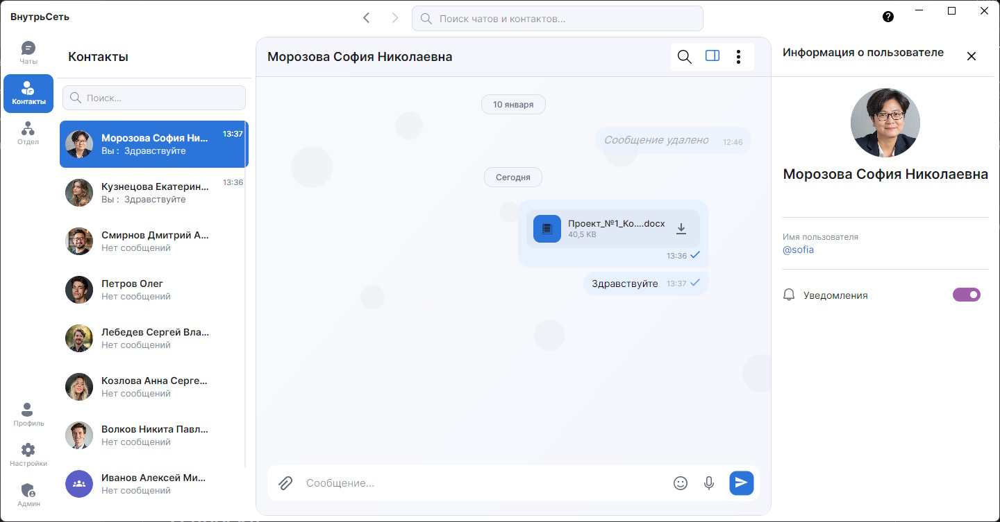

# Корпоративный мессенджер

<div align="center">

[](https://dotnet.microsoft.com/)
[](https://avaloniaui.net/)
[](https://www.postgresql.org/)
[](https://learn.microsoft.com/aspnet/core/signalr/)
[](https://docs.docker.com/compose/)
[]()



**Готовое решение для внутренней коммуникации в компании.** Обмен сообщениями, файлами и голосовыми заметками, управление отделами и ролями в реальном времени.

</div>

---

## О проекте

Система построена по архитектуре **клиент-сервер**:
- **Backend (API):** ASP.NET Core 10 REST API + SignalR Hub. База данных — PostgreSQL 16. Серверная часть контейнеризирована (Docker).
- **Frontend (Desktop):** Кроссплатформенный десктоп-клиент на **Avalonia UI**. Использует архитектуру **MVVM** и стратегию **Offline-first** с локальной базой SQLite и FTS5.
- **Shared (Shared):** Общие DTO и контракты данных.

### Ключевые особенности
- **Безопасность:** JWT ротация токенов (FamilyId), BCrypt паролей, Rate Limiting, разграничение уровней доступа.
- **Real-time:** Мгновенные уведомления, статусы набора текста, прочтения, онлайн/офлайн через SignalR.
- **Кэширование:** Быстрый офлайн-доступ к истории чатов через SQLite + FTS5 поиск.
- **Файлы:** Отправка файлов до 100 МБ, автоконвертация аватаров в WebP.
- **Голосовые:** Запись и воспроизведение голосовых сообщений.

---

## Возможности

### Коммуникация
- Личные диалоги и групповые чаты
- Опросы с анонимным и множественным голосованием
- Ответы на сообщения (Quote) и пересылка (Forward)
- Редактирование и удаление сообщений (soft-delete)
- Голосовые сообщения
- Индикаторы прочтения (Read Receipts) и статус "печатает..."
- Настройка уведомлений (мут чата)

### Организация
- Иерархические отделы (дерево без циклов)
- Ролевая модель: Пользователь / Руководитель отдела / Администратор
- Управление составом отделов и назначением руководителей
- Глобальный поиск по всем чатам и сообщениям с подсветкой совпадений

### Клиент
- Работает на Windows и Linux
- Темы оформления (светлая / тёмная / системная)
- Безопасное хранение учётных данных (Secure Storage)
- Асинхронная загрузка изображений (аватары, вложения)

### Администрирование
- Панель управления пользователями (бан/разбан, смена пароля)
- Создание и управление структурой организации
- Контейнеризация сервера (Healthchecks, Restart Policies)

---

## Технологический стек

| Компонент | Технологии | Версия |
|-----------|------------|--------|
| **Runtime** | .NET | 10.0 |
| **Сервер** | ASP.NET Core Web API + SignalR | 10.0 |
| **Клиент** | Avalonia UI (MVVM) + CommunityToolkit.Mvvm | 11.3.12 |
| **ORM (Server)** | Entity Framework Core | 10.0 |
| **ORM (Client)** | sqlite-net-pcl | 1.9.172 |
| **База данных** | PostgreSQL + Npgsql | 16 / 10.0 |
| **Audio** | NAudio | 2.3.0 |
| **Security** | JwtBearer, BCrypt.Net-Next | 10.0.5 / 4.1.0 |
| **Images** | SixLabors.ImageSharp.Web | 3.2.0 |

---

## Структура проекта

```text
📦 Messenger
│
├── 📂 Shared/         # Общие компоненты (Class Library)
│   ├── 📂 DTO/                 # Объекты передачи данных
│   │   ├── Auth/               # LoginRequest, TokenResponseDto
│   │   ├── Chat/               # ChatDto, ChatMemberDto
│   │   ├── Message/            # MessageDto, CreateMessageRequest
│   │   ├── User/               # UserDto, CreateUserDto
│   │   └── ...                 # Poll, Notification, Department, Search, ReadReceipt
│   ├── 📂 Enum/                # ChatType, ChatRole, Theme, UserRoles, SystemEventTypes
│   └── 📂 Response/            # ApiResponse<T>
│
├── 📂 API/            # Серверная часть (ASP.NET Core)
│   ├── 📂 Controllers/         # REST API endpoints
│   │   ├── BaseController      # ExecuteAsync (Result → HTTP)
│   │   ├── AuthController      # Login, Refresh, Revoke
│   │   ├── ChatsController     # CRUD чатов, участники
│   │   ├── MessagesController  # Сообщения, поиск, пагинация
│   │   ├── PollsController     # Опросы
│   │   └── ...                 # Users, Departments, Admin, Files, Notifications
│   ├── 📂 Hubs/                # ChatHub (/chatHub)
│   ├── 📂 Model/               # EF Core сущности + MessengerDbContext
│   ├── 📂 Services/            # Бизнес-логика
│   │   ├── Infrastructure/     # CacheService, AccessControlService, HubNotifier, OnlineUserService
│   │   ├── Messaging/          # MessageService, FileService, PollService
│   │   ├── Chat/               # ChatService, ChatMemberService, NotificationService
│   │   └── ...                 # AuthService, UserService, DepartmentService
│   ├── 📂 Mapping/             # Ручной маппинг моделей → DTO
│   ├── 📂 Middleware/          # ExceptionHandling, MissingFileCleanup
│   ├── 📂 Configuration/       # DI, Swagger, JWT, RateLimit
│   └── 📄 Dockerfile
│
├── 📂 Desktop/        # Клиент (Avalonia UI)
│   ├── 📂 ViewModels/          # MVVM логика
│   │   ├── Shell/              # MainWindowViewModel, MainMenuViewModel
│   │   ├── Chat/               # ChatViewModel (Handler Composition)
│   │   │   ├── Handlers/       # Edit, Reply, Forward, Typing, Voice, Search, Notifications
│   │   │   └── Managers/       # ChatMessageManager, ChatAttachmentManager
│   │   ├── ChatList/           # ChatsViewModel, GlobalSearchManager
│   │   ├── Dialog/             # Модальные диалоги
│   │   └── Factories/          # ChatViewModelFactory
│   ├── 📂 Services/            # Сервисы клиента
│   │   ├── Api/                # ApiClientService (auto-refresh при 401)
│   │   ├── Auth/               # AuthManager, SecureStorage, SessionStore
│   │   ├── Realtime/           # GlobalHubConnection (единый SignalR-клиент)
│   │   └── Audio/              # AudioPlayerService, NAudioRecorderService
│   ├── 📂 Data/                # Локальный кэш
│   │   ├── LocalDatabase       # SQLite + FTS5, схема v3
│   │   └── Repositories/       # LocalCacheService, Chat/MessageCacheRepository
│   ├── 📂 Converters/          # Value converters для Avalonia bindings
│   └── 📂 Views/               # AXAML разметка
│
├── 📄 docker-compose.server.yml
├── 📄 README.md
└── 📄 LICENSE
```

---

## Установка

### Системные требования
- OS: Windows 10+ / Linux (Ubuntu 20.04+)
- RAM: 4 GB минимум / 8 GB рекомендуется
- Disk: 500 MB

### Развёртывание сервера (Docker)

```bash
# 1. Клонировать репозиторий
git clone https://github.com/username/messenger.git
cd messenger

# 2. Запустить сервер и БД
docker compose -f docker-compose.server.yml up -d

# 3. Проверить логи
docker compose logs -f postgres
docker compose logs -f messenger-api
```

По умолчанию сервер доступен на порту **8080**.

> **Примечание:** Первый запуск может занять время на миграцию базы данных.

### Развёртывание клиента (Release)
1. Скачайте архив из Releases (Windows / Linux).
2. Распакуйте в удобную папку.
3. Установите **[.NET 10 Runtime](https://dotnet.microsoft.com/download/dotnet/10.0)**.
4. Запустите `Desktop.exe` (Windows) или бинарник (Linux).

> Учётные данные шифруются средствами ОС при сохранении (Secure Storage).

---

## Архитектурные особенности

### Backend
- **Result Pattern:** Сервисы возвращают `Result<T>` вместо исключений. `BaseController.ExecuteAsync` автоматически маппит результат на HTTP-статус и `ApiResponse<T>`.
- **Access Control:** `AccessControlService` проверяет права (Owner/Admin/Member) перед выполнением бизнес-логики.
- **Caching:** `IMemoryCache` для списков чатов (TTL 5 мин) и состава участников (TTL 10 мин) с явной инвалидацией.
- **Rate Limiting:** Sliding Window Policy для Login, Upload, Search, Messaging.
- **SignalR:** Единый `ChatHub` с рассылкой через `HubNotifier`. Группы: `chat_{id}` и `user_{id}`.

### Frontend (MVVM)
- **Handler Composition:** `ChatViewModel` разделён на независимые Handler-классы (Edit, Reply, Forward, Typing...) для снижения связанности.
- **Stale-While-Revalidate:** При открытии чата мгновенно показываются данные из SQLite, параллельно загружаются свежие с сервера.
- **Offline-First:** Все важные данные хранятся в SQLite. Локальный поиск через FTS5.
- **Global Hub Connection:** Одно WebSocket-соединение на всё приложение. Фильтрация событий по чату через `ChatHubSubscriber`.

---

## Скриншоты

<details>
<summary><b>Темы оформления</b></summary>

| Светлая тема | Тёмная тема |
|:-------------:|:-----------:|
| *(Screenshot)* | *(Screenshot)* |
</details>

<details>
<summary><b>Рабочее пространство</b></summary>

| Список диалогов | Переписка с опросом |
|:---------------:|:-------------------:|
| *(Screenshot)* | *(Screenshot)* |
</details>

<details>
<summary><b>Администрирование</b></summary>

| Управление пользователями | Управление отделами |
|:-------------------------:|:-------------------:|
| *(Screenshot)* | *(Screenshot)* |
</details>

---

## API Документация

После запуска сервера Swagger доступен по адресу:
`http://localhost:8080/swagger`

### Основные эндпоинты

#### Аутентификация
| Endpoint | Метод | Описание |
|----------|-------|----------|
| `/api/auth/login` | POST | Вход, получение токенов |
| `/api/auth/refresh` | POST | Обновление access-токена |
| `/api/auth/revoke` | POST | Выход (отзыв всех refresh-токенов) |

#### Чаты и сообщения
| Endpoint | Метод | Описание |
|----------|-------|----------|
| `/api/chats/user/{userId}` | GET | Список чатов пользователя |
| `/api/chats/{id}/members` | GET | Участники чата |
| `/api/messages/chat/{id}` | GET | История сообщений (paginated) |
| `/api/messages` | POST | Отправить сообщение |
| `/api/messages/{id}` | PUT | Редактировать сообщение |
| `/api/messages/{id}` | DELETE | Удалить сообщение (soft-delete) |

#### Пользователи
| Endpoint | Метод | Описание |
|----------|-------|----------|
| `/api/users/{id}` | GET | Профиль пользователя |
| `/api/users/{id}/avatar` | POST | Загрузка аватара |
| `/api/admin/users` | GET | Список всех пользователей (Admin) |

#### SignalR
Подключение: `{ApiUrl}/chatHub`
Ключевые события: `ReceiveMessageDto`, `UserOnline`, `UserOffline`, `UserTyping`, `MessageRead`, `UnreadCountUpdated`

---

## Глоссарий

| Термин | Значение |
|--------|----------|
| **Result Pattern** | Паттерн обработки ошибок без исключений (`Result<T>.Success()` / `Result.NotFound()`) |
| **Soft Delete** | Удаление помечается флагом `is_deleted=true`, запись остаётся в БД |
| **FamilyId** | Группа связанных Refresh-токенов для обнаружения replay-атак |
| **Handler Composition** | Паттерн декомпозиции `ChatViewModel` на независимые Handler-классы |
| **Gap-fill** | Догрузка пропущенных сообщений после переподключения SignalR |