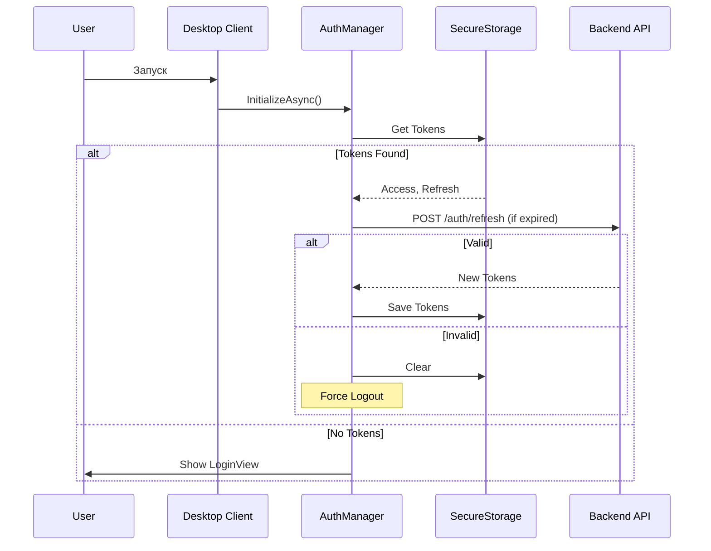

## Обзор решения
Решение состоит из трёх проектов:
1. **MessengerAPI** — ASP.NET Core Web API (REST + SignalR).
2. **MessengerDesktop** — Avalonia UI Desktop Client (MVVM, SQLite, Local DB).
3. **MessengerShared** — Общие DTO, Enum-ы и контракты ответов.

### Взаимодействие
| Направление | Протокол | Формат данных | Аутентификация |
|-------------|----------|---------------|----------------|
| Desktop → API | HTTPS / REST | JSON (`ApiResponse<T>`) | JWT Bearer Token |
| Desktop ↔ API | WebSocket | SignalR binary/text | JWT в `accessTokenProvider` |

---

## Backend Architecture (MessengerAPI)

### Слои взаимодействия
```
[Controllers] 
     ↓ [BaseController.ExecuteAsync → Result Pattern]
[Services] (Business Logic, Transaction boundaries)
     ↓ [Infrastructure Layer (Cache, AccessControl, Hub)]
[Model / DbContext] (EF Core)
```

#### Контроллеры
- Все наследуют `BaseController<T>`.
- Автоматическая маппинг ошибок из `Result<T>` в HTTP статус + `ApiResponse<T>`.
- Извлечение текущего пользователя через `GetCurrentUserId()` (Claim NameIdentifier).
- Rate Limiting настроен на уровне контроллера (Policy Injection) или встроенной инфраструктурой.

#### Сервисы
- **Бизнес-сервисы**:
  - `ChatService`: Управление чатами (CRUD), аватарами, инвайдитами участников, инвалидацией кэша после записей.
  - `MessageService`: CRUD сообщений (создание через `CreateMessageRequest`, отдельный от `MessageDto` входной контракт), пагинация (окно вокруг сообщения, до/после), поиск (GlobalSearch, FTS-style ILike), обновления непрочитанных, уведомления. Создание сообщения атомарно — один `SaveChanges` для Message, VoiceMessage, файлов и обновления чата.  
  - `PollService`: Создание опросов, голосование.
  - `UserService` / `AdminService`: Пользователи, роли.
  - `DepartmentService`: Департаментская иерархия.
- **Инфраструктурные**:
  - `HubNotifier`: Отправка событий в SignalR (Fire-and-forget).
  - `CacheService`: IMemoryCache с TTL (Chats: 5 мин, Membership: 10 мин). Инвалидация по ключам.
  - `AccessControlService`: Проверка прав доступа (Member/Admin/Owner). Кэширует текущую роль на время запроса (`_requestCache`), но использует БД с кэшем для первичного чтения.
- **База данных**: `MessengerDbContext` (EF Core) с транзакциями при создании чатов.

#### База данных
- **СУБД**: PostgreSQL.
- **ORM**: EF Core 9 с миграциями.
- **Энум-ы**: Postgres enum-ы регистрируются в API; `MessengerShared` не содержит `PgName`, а специальные label-ы задаются через API-side name translator-ы.
- **Конфигурация**: `UseNpgsql(..., npgsql => npgsql.MapEnum(..., nameTranslator: ...))` + `HasPostgresEnum(..., nameTranslator: ...)` в `MessengerDbContext`.

#### Безопасность и потоки токенов
- **Password Hashing**: BCrypt.Net-Next.
- **Tokens**:
  - **Access Token**: JWT, короткое время жизни.
  - **Refresh Token**: SHA-256 хеш в БД, семья ротации (`FamilyId`). При ротации обновляется `ReplacedByTokenId`.
- **Rate Limiting**: Sliding Window (Global + Policies `login`, `messaging`, `search`).

---

## Desktop Client Architecture (MessengerDesktop)

### Паттерн: MVVM
```
Avalonia View (.axaml)
       ↓ Data Binding
ViewModel (CommunityToolkit.Mvvm)
       ↓ Dependency Injection
Services / Repositories (Local DB, Network)
```

### Жизненный цикл приложения
1. **Startup (`App.axaml`)**
   - Создание `ServiceProvider` (DI).
   - Регистрация всех сервисов (Core Services + ViewModels).
   - Запуск фоновой инициализации базы данных (`InitializeLocalDatabaseAndMaintenanceAsync`).
   - Создание `MainWindow` и привязка `DataContext = MainWindowViewModel`.
   - Подключение SignalR (`GlobalHubConnection.ConnectAsync()`) происходит из `MainMenuViewModel`.
2. **Начало работы**
   - Проверка авторизации через `AuthManager`.
   - Если нет токена или истёк — `LoginViewModel`.
   - Иначе — `MainWindowViewModel`.
3. **Работа**
   - Кэширование данных в SQLite (Offline-first) при каждой загрузке.
   - Обработка 401 (Unauthorized) в `ApiClientService` автоматически вызывает `AuthManager.TryRefreshTokenAsync()`.
4. **Закрытие**
   - `Dispose()` на контейнере и сервисы, отписка от событий.

### Интеграция с Backend
- **ApiClientService**: Обёртка над HttpClient. Реализует логику повторного входа при 401 (с учетом исключений `NoRefreshUrls`).
  - Поток загрузки файлов (>10MB) отправляется во временный файл (Temp File), чтобы не перегружать память.
- **Hub Connection**: Единожды при запуске. Фильтрация событий происходит внутри `ChatHubSubscriber`.
- **Authentication**: `SessionStore` хранит ID юзера и токены. Токен инжектится в каждый запрос (`Authorization: Bearer ...`).

---

## Детали реализации ключевых модулей

### 1. Кэширование (Caching Strategy)

| Уровн | Технология | Политика |
|-------|------------|-----------|
| **Backend (Сервер)** | `IMemoryCache` | Чтение пользователей/чатов кэшируется (5 мин для списков, 10 мин для состава). После записи (создание чата, удаление участника) ключи инвалидируются явно (`InvalidateUserChats`, `InvalidateMembership`). Локальный кэш запросов (`AccessControlService._requestCache`) сбрасывается между HTTP-запросами. |
| **Frontend (Клиент)** | SQLite (`sqlite-net-pcl`) | Полная синхронизация списка чатов и сообщений. Используется `Fts5` для текстового поиска. Есть таблица `chat_sync_state` для трекинга последнего загруженного сообщения. Кэш сохраняется после каждого успешного API-запроса. |

### 2. Управление правами доступа (AccessControl)

Все методы в сервисах используют `IAccessControlService` перед выполнением логики.
- **IsMemberAsync**: Проверяет наличие записи в `ChatMembers`.
- **IsAdminAsync**: Проверяет роль `Admin` или `Owner`.
- **CheckIsOwnerAsync**: Строго проверяет `Owner`.
- **Поток**:
  1. Проверка прав происходит через `AccessControlService.CheckIsMemberAsync(userId, chatId)`.
  2. Внутри вызывается `GetMembershipAsync`, который сначала смотрит в `IMemoryCache` (backend) или `_requestCache` (на один запрос), затем в БД.
  3. Результат возвращается как `Result<bool>` или `Result<Forbidden>`.

### 3. Авторизация и токены (AuthManager)

- **Инициализация**:
  - При старте приложения `AuthManager` пытается прочитать сохранённые токены из `SecureStorage`.
  - Если Access Token валиден (локальная проверка длительности) — сессия восстанавливается.
  - Если истёк — запускается фоновый `RefreshTokenAsync`. Если успешно — сохраняются новые токен + RefreshToken в SecureStorage и SessionStore.
  - Если ошибка сервера (401/403) — очищается всё и пользователь перенаправляется на вход.
- **Refresh Lock**:
  - Защита от параллельных рефрешей (`_refreshLock` + `_activeRefreshTask`). Если рефреш уже идёт, другие запросы ждут завершения текущего.
- **Logout**:
  - Вызывает `/api/auth/revoke` (для отзыва всех refresh-токенов пользователя), очищает SecureStorage, SessionStore, LocalDB.

### 4. Клиентское API (ApiClientService)

- **Retry Logic**:
  - При получении 401 `SendWithRefreshAsync` вызывает `TryRefreshTokenAsync`.
  - Если рефреш успешен — исходный запрос повторяется.
  - Если нет — выбрасывается явная ошибка "Сессия истекла".
- **Обработка больших файлов**:
  - Если размер файла > 10 MB (`LargeFileThreshold`) — используется буферное чтение и запись во временный файл, чтобы не держать весь поток в оперативной памяти.
- **JSON**:
  - Сериализация через `System.Text.Json` с настройкой `CamelCase` и игнорированием `null`.
  - Автоматическая оборачивание ответа в `ApiResponse<T>`.

### 5. Оффлайн-режим и Поиск

- **Кэш**: `LocalDatabase` имеет версию схемы (v3). При старте мигрируется если нужно.
- **Поиск**:
  - **Глобальный**: Выполняется на сервере (`GlobalSearchAsync`), возвращает список чатов и сообщений.
  - **Локальный**: При наличии подключения можно искать по `messages_fts` (FTS5), но основная логика пока реализована через серверный вызов.
- **Синхронизация**:
  - `GlobalHubConnection` при реконнекте запрашивает актуальные счётчики `GetUnreadCounts`.
  - `ChatViewModel` при открытии чата делает паузу `WaitForInitializationAsync` до загрузки истории из кэша/сервера.

---

## Схема взаимодействия (Sequence Example: Login Flow)



---

## Технический долг и ограничения

| Область | Текущее состояние | Риск / TODO |
|---------|-------------------|-------------|
| **Оффлайн режим** | Чтение возможно без сети, но новые сообщения не отправятся (требуется репост при восстановлении связи). | Нет очереди оффлайн-запросов. При потере сети сообщение пропадает. |
| **Поиск** | Используется FTS5 для текста. Поиск по файлам только метаданными. | Полный поиск по содержимому файлов пока не поддерживается. |
| **Медиа** | Клиент не обрабатывает превью изображений сам — это делает сервер (ImageSharp.Web). | Нет локального кеширования картинок (кроме пути в URL). |
| **Кэширование** | Нет очистки старых сообщений при переполнении лимита (TODO: LRU policy). | Возможна потеря места при длительном использовании. |
| **Конкурентность** | Редактирование одного чата с двух устройств работает строго последовательно (по серверу). | Нет Optimistic Locking для чатов (только обновление состояния через SignalR). |